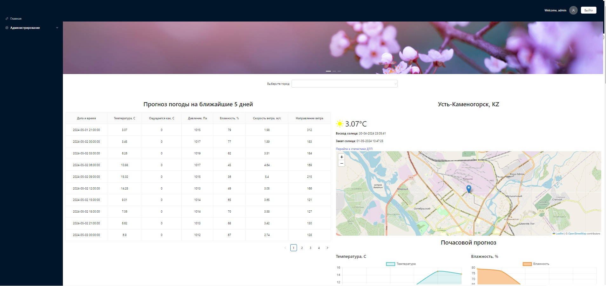
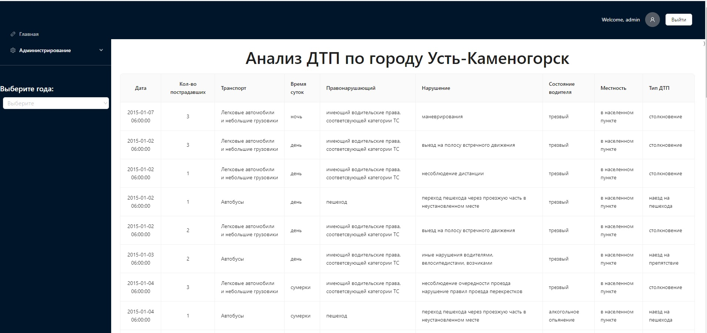
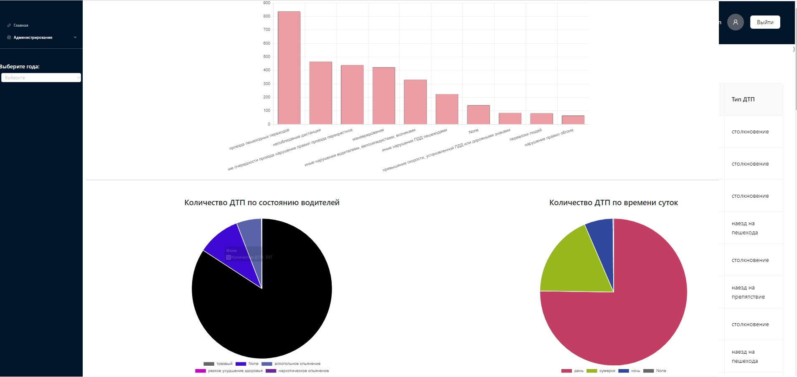

# ASP.NET Core / React+Vite App

This app is using  ASP.NET Core 8.0 for a REST/JSON API server and React+Vite for a web client.


**<h2>Description</h2>** 

This is a small application designed to demonstrate the use of ASP.NET Core and React+Vite in modern web development. The application includes a server-side component implemented in ASP.NET Core 8.0, which provides an API for working with users and roles, as well as a client-side component written in React using the Vite build tool.










# Graphical Tools and Data Summaries

To showcase the graphical visualization capabilities of the application, the following summaries are presented:

## Weather Summaries

On the main page of the application, users can view current weather conditions and forecasts for the near future. An API is used to fetch weather data, incorporating graphical elements such as weather icons, temperature charts, etc.

## Traffic Accident Statistics

The application also provides statistical information on traffic accidents (Road Traffic Accidents, RTAs). The data is presented using graphs, charts, and tables, allowing users to quickly assess road conditions.

## Examples of Graphical Tools

The `/` and `/yka-car-accident ` section showcases examples of various graphical tools, including:

- Temperature and humidity charts.
- Pie charts comparing weather metrics.
- Line charts forecasting weather for upcoming days.
- Interactive maps displaying traffic accident statistics.
- Number of accidents by category\
- Location of accident cases on the map
- Number of accidents by mode of transport
- Number of accidents annually (2015-2024)

## Overview of Stack
- Server
    - ASP.NET Core 8.0
    - PostgreSQL 15
    - Entity Framework Core w/ EF Migrations
    - Http.Session authorization
- Client
    - React 18.22
    - Vite 5.1.0    
    - CSS Modules
    - Ant design
    - Axios for REST requests

## Session Management
To manage authentication state and store session data, the application utilizes the ASP.NET Core session mechanism. Sessions enable storing state between requests to the server and provide secure storage of session data.

**Key features of session usage:**


- Data storage: All session data is stored on the server, providing an additional layer of security and data control.</br>
- Ease of Use: ASP.NET Core provides a convenient API for working with sessions, simplifying session data creation and management. </br>
- Expiration Configuration: Sessions can be configured to automatically expire after a specified period of inactivity, helping to manage server memory and data security. </br>
- Data Uniqueness : Each user has a unique session, allowing tracking the state of each client independently of others.


## Scripts

### `npm install`

When first cloning the repo or adding new dependencies, run this command.  This will:

- Install Node dependencies from package.json
- Install .NET Core dependencies (using dotnet restore)


## Working with Swagger
<h3>Swagger Integration</h3>

The ASP.NET Core backend uses Swagger to provide a detailed API documentation and testing interface. You can access the Swagger UI at https://localhost:5000/swagger/index.html.

<h3>Generating Client Code with NSwag</h3>
You can generate client code for your React application using NSwag. Here’s how you can configure and use NSwag for JavaScript:

1. Install NSwag CLI: npm install nswag
2. Create NSwag Configuration File (nswag.json)   

3. Generate Client Code:

   "scripts": {
   "generate-client": "nswag run nswag.json"
   }
4. Run the script:
```bash   
   npm run generate-client
```

## Usage

After installing and running the application, you can open it in your browser at https://localhost:5000/ and start using it. On the main page, you will see weather summaries, charts, and tables with weather forecasts. To access the administration panel, click on the "Administration" link in the top menu.


**<h2>Contributing</h2>**

We welcome contributions to the development of the project! If you have ideas, suggestions, or find any bugs, please create an Issue or Pull Request in the repository.


License
This project is licensed under the terms of the MIT License.